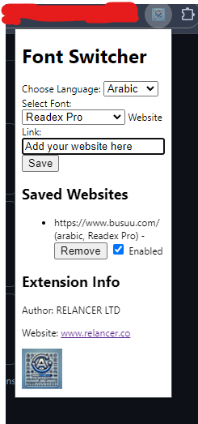

# Font Switcher

**Font Switcher** is a Chrome extension that allows you to add custom fonts from Google Fonts to specific websites. This can be useful for improving readability or simply for aesthetic preferences.

## Features

* **Choose Language:** Select from a list of supported languages (currently Arabic and English).
* **Select Font:** Choose from a variety of Google Fonts for the selected language.
* **Add Website:** Specify the website URL where you want to apply the custom font.
* **Save and Apply:** Save the settings, and the extension will automatically apply the chosen font to the specified website.
* **Multiple Websites:** Add and save settings for multiple websites.
* **Enable/Disable Fonts:** Easily enable or disable custom fonts for specific websites without deleting the website from the list.
* **Remove Websites:** Remove websites from the list if you no longer want to apply custom fonts to them.

## Version History

### 1.0 (Initial Release)

* Basic functionality:
    * Choose language (Arabic/English)
    * Select font from a list
    * Specify website URL
    * Save and apply font to the website

### 1.1 (Enhanced Website Management)

* Added features:
    * Enable/disable fonts for specific websites
    * Remove websites from the list

## Installation

1.  Download the extension files from [GitHub](Custom-Font-Applier---Chrome-Extension).
2.  Open Chrome and go to `chrome://extensions/`.
3.  Enable "Developer mode" in the top right corner.
4.  Click "Load unpacked" and select the directory where you downloaded the extension files.

## Usage

1.  Click the extension icon in the Chrome toolbar.
2.  Choose the language and select the desired font.
3.  Enter the website URL where you want to apply the font.
4.  Click "Save".
5.  The extension will automatically apply the font to the specified website after refreash page.

## Contributing

Contributions are welcome! Feel free to submit bug reports, feature requests, or pull requests.

## License

## License

This project is licensed 1  under the GNU General Public License v3.0 - see the [LICENSE]([LICENSE](https://www.gnu.org/licenses/gpl-3.0.txt)) file for details.
